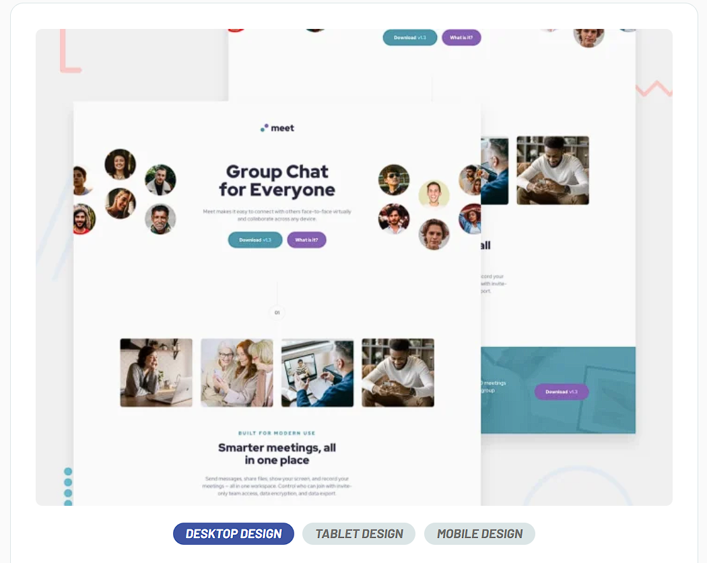

# Vue 3 + TypeScript + Vite
## Meet landing page

This HTML & CSS only challenge is perfect if you're starting to get a bit comfortable with your layout skills. The responsive layout shifts will also be a great test!

[live version](https://yonerfy.github.io/meet-landing-page-live/)

Your challenge is to build out this landing page and get it looking as close to the design as possible.

You can use any tools you like to help you complete the challenge. So if you've got something you'd like to practice, feel free to give it a go.

Your users should be able to:

View the optimal layout depending on their device's screen size
See hover states for interactive elements
